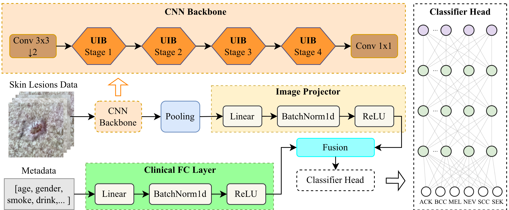

# LiMDF-Net: A Lightweight Multimodal Direct Fusion Network for Skin Lesion Classification

[](https://www.python.org/)
[](https://pytorch.org/)
[](LICENSE)



This repository contains the official implementation of **LiMDF-Net** (Lightweight Multimodal Direct Fusion Network), a lightweight deep learning model for skin lesion classification using multimodal data fusion. LiMDF-Net efficiently combines dermoscopic images and clinical metadata to achieve competitive performance with minimal computational overhead, making it suitable for deployment on edge devices.

## Key Features

- **Lightweight Architecture**: Only 2.89M parameters with 0.318 GFLOPs, significantly smaller than state-of-the-art methods
- **Multimodal Fusion**: Integrates visual and clinical information through optimized fusion techniques
- **Edge Device Compatible**: Designed for deployment on resource-constrained devices (Jetson Orin, Raspberry Pi 5, etc.)
- **Robust Preprocessing**: Color constancy and CLAHE applied to dermoscopic images, missing value imputation for clinical data
- **Comprehensive Evaluation**: Extensive ablation studies and performance benchmarks on PAD-UFES-20 dataset

## Performance

LiMDF-Net achieves **81.2% accuracy** with simple concatenation fusion while maintaining significantly lower model size and computational cost compared to competing approaches:

| Model | Params | GFLOPs | Accuracy | Precision | Recall | F1 Score |
|-------|--------|--------|----------|-----------|--------|----------|
| AuxNet | 134.2M | 13.5 | 0.849 | 0.825 | 0.832 | 0.828 |
| DualRefNet | 134.2M | 13.5 | 0.851 | 0.828 | 0.847 | 0.837 |
| **LiMDF-Net** | **2.89M** | **0.318** | **0.812** | **0.786** | **0.802** | **0.808** |

## Dataset

The model is trained and evaluated on the **PAD-UFES-20** dataset, which contains:
- 2,298 dermoscopic images from 1,200 patients
- 6 skin lesion types: Actinic Keratosis (ACK), Basal Cell Carcinoma (BCC), Melanoma (MEL), Nevus (NEV), Seborrheic Keratosis (SCC), Seborrheic Keratosis (SEK)
- Associated clinical metadata including age, gender, and smoking status
- Patient-stratified data splits to ensure proper train-test separation

## Architecture

### Image Processing Pipeline

The model processes dermoscopic images through:
1. **Color Constancy**: Normalization using the Grayworld algorithm to handle varying lighting conditions
2. **CLAHE (Contrast Limited Adaptive Histogram Equalization)**: Contrast enhancement while preventing over-amplification of noise
3. **Resizing**: Images resized to 256×256 pixels

### Clinical Data Processing

Clinical metadata is processed through:
1. **Missing Value Imputation**: Fully connected layer with batch normalization and ReLU
2. **Feature Extraction**: Linear projection followed by normalization

### Model Components

**Image Backbone**: MobileNetv4 with Generalized Mean (GeM) pooling instead of global average pooling, extracting 512-dimensional image features

**Fusion Module**: Implements four different fusion strategies:
- Simple Concatenation
- Hadamard Product
- Cross-Attention
- Self-Attention

**Classification Head**: Multi-layer perceptron with batch normalization predicting one of six lesion types

## Ablation Studies

### Single Modality vs. Multimodal

| Model | Accuracy | BACC | AUC |
|-------|----------|------|-----|
| Clinical only (FC Layer) | 0.705 ± 0.008 | 0.606 ± 0.040 | 0.874 ± 0.011 |
| Image only (LiMCA-Net) | 0.699 ± 0.003 | 0.646 ± 0.026 | 0.910 ± 0.008 |
| Multimodal (Simple Concat) | **0.812 ± 0.006** | **0.786 ± 0.018** | **0.952 ± 0.001** |

### Fusion Technique Comparison

| Fusion Technique | Params | Accuracy | BACC | AUC |
|------------------|--------|----------|------|-----|
| Simple Concatenation | 2.89M | 0.812 ± 0.006 | 0.786 ± 0.018 | 0.952 ± 0.001 |
| Hadamard Product | 2.89M | 0.797 ± 0.008 | 0.754 ± 0.029 | 0.940 ± 0.006 |
| Cross-Attention | 2.96M | 0.805 ± 0.008 | 0.774 ± 0.031 | 0.948 ± 0.003 |
| Self-Attention | 3.14M | 0.785 ± 0.003 | 0.748 ± 0.014 | 0.941 ± 0.002 |

Simple concatenation provides the best balance between performance and efficiency.

### Pooling Strategy Comparison

| Model | Params | GFLOPs | Accuracy | BACC | AUC |
|-------|--------|--------|----------|------|-----|
| LiMDF-Net-0.5 (GeM) | 2.89M | 0.318 | 0.802 ± 0.009 | 0.772 ± 0.014 | 0.948 ± 0.002 |
| **LiMDF-Net-0.5 (GAP)** | **2.89M** | **0.318** | **0.812 ± 0.006** | **0.786 ± 0.018** | **0.952 ± 0.001** |
| LiMDF-Net-1.0 (GAP) | 3.40M | 0.319 | 0.800 ± 0.008 | 0.769 ± 0.035 | 0.944 ± 0.004 |
| LiMDF-Net-1.5 (GAP) | 9.96M | 1.158 | 0.790 ± 0.003 | 0.752 ± 0.010 | 0.941 ± 0.008 |

The 0.5-scale model with global average pooling (GAP) achieves optimal performance-efficiency trade-off.

## Installation

### Requirements

- Python 3.8 or higher
- PyTorch >= 1.9
- torchvision
- scikit-learn
- numpy
- opencv-python

### Setup

1. Clone the repository:
```bash
git clone https://github.com/your-username/LiMDF-Net.git
cd LiMDF-Net
```

2. Install dependencies:
```bash
pip install -r requirements.txt
```

## Training

### Basic Training

To train the model on the PAD-UFES-20 dataset:

```bash
python train.py --epochs 100 --batch_size 32 --learning_rate 0.001 --fusion simple_concat
```

### Training Arguments

```
--epochs EPOCHS                Number of training epochs (default: 100)
--batch_size BATCH_SIZE        Training batch size (default: 32)
--learning_rate LR             Learning rate (default: 0.001)
--fusion {concat, hadamard, cross_attention, self_attention}
                               Fusion technique to use (default: concat)
--scale {0.5, 1.0, 1.5, 2.0}  Model width scaling factor (default: 0.5)
--seed SEED                    Random seed for reproducibility (default: 42)
--device {cuda, cpu}           Device for training (default: cuda)
--save_path PATH               Path to save checkpoints (default: ./checkpoints)
```

### Example with Custom Configuration

```bash
python train.py \
    --epochs 150 \
    --batch_size 64 \
    --learning_rate 0.0005 \
    --fusion cross_attention \
    --scale 1.0 \
    --seed 123 \
    --save_path ./my_checkpoints
```

## Evaluation

### Model Testing

Evaluate the trained model on the test set:

```bash
python evaluate.py --checkpoint ./checkpoints/best_model.pth
```

### Evaluation Metrics

The model is evaluated using:
- **Accuracy (ACC)**: Overall classification accuracy
- **Balanced Accuracy (BACC)**: Macro-averaged recall across classes
- **Area Under ROC Curve (AUC)**: One-vs-rest AUC for multi-class classification
- **Precision**: Per-class and macro-averaged precision
- **Recall**: Per-class and macro-averaged recall
- **F1 Score**: Harmonic mean of precision and recall

### Example Output

```
Accuracy: 0.812 ± 0.006
Balanced Accuracy: 0.786 ± 0.018
AUC (macro): 0.952 ± 0.001
Precision (macro): 0.786
Recall (macro): 0.802
F1 Score (macro): 0.808
```

## Edge Deployment

LiMDF-Net is optimized for edge device deployment with minimal latency and memory requirements:

### Supported Devices

- NVIDIA Jetson Orin
- Raspberry Pi 5
- Desktop GPU (NVIDIA)
- Mac GPU (Metal Performance Shaders)

### Deployment Guide

Convert the model to edge-optimized formats:

```bash
python convert_to_onnx.py --checkpoint ./checkpoints/best_model.pth --output_path ./onnx_model
```

Measure inference performance:

```bash
python benchmark_edge.py --model_path ./onnx_model --device jetson_orin
```

## Visualization

### Grad-CAM Visualization

Visualize model attention for prediction interpretability:

```bash
python visualize_gradcam.py --image_path ./sample_image.jpg --checkpoint ./checkpoints/best_model.pth
```

### ROC Curves

The model achieves excellent discrimination across all lesion types with AUC values:
- Actinic Keratosis (ACK): 0.94
- Basal Cell Carcinoma (BCC): 0.93
- Melanoma (MEL): 1.00
- Nevus (NEV): 1.00
- Seborrheic Keratosis (SCC): 0.89
- Solar Lentigines (SEK): 0.95

## Project Structure

```
LiMDF-Net/
├── data/                          # Dataset directory
│   ├── PAD-UFES-20/
│   │   ├── images/
│   │   └── metadata/
│   └── preprocessing/
├── models/                        # Model definitions
│   ├── backbone.py               # MobileNetv4 backbone
│   ├── fusion.py                 # Fusion modules
│   └── limdf_net.py              # Main model
├── utils/                        # Utility functions
│   ├── preprocessing.py          # Image and data preprocessing
│   ├── metrics.py                # Evaluation metrics
│   └── gradcam.py                # Grad-CAM visualization
├── train.py                      # Training script
├── evaluate.py                   # Evaluation script
├── visualize_gradcam.py          # Visualization script
├── benchmark_edge.py             # Edge device benchmarking
├── convert_to_onnx.py           # Model conversion
├── requirements.txt              # Dependencies
├── README.md                     # This file
└── LICENSE                       # Apache 2.0 License
```

## Configuration

Training configurations can be specified in a YAML file:

```yaml
# config.yaml
dataset:
  name: pad_ufes_20
  data_path: ./data/PAD-UFES-20
  train_split: 0.7
  val_split: 0.1
  
preprocessing:
  image_size: 256
  color_constancy: true
  clahe: true
  
model:
  scale: 0.5
  fusion: simple_concat
  
training:
  epochs: 100
  batch_size: 32
  learning_rate: 0.001
  optimizer: adam
  scheduler: cosine
  loss: weighted_focal_loss
  
augmentation:
  random_flip: true
  random_rotation: true
  color_jitter: true
```

Then train with:

```bash
python train.py --config config.yaml
```

## Results and Analysis

### Per-Class Performance

LiMDF-Net demonstrates robust performance across all lesion types with minimal class-wise variance:

| Class | Sensitivity | Specificity | Precision | F1 Score |
|-------|-------------|------------|-----------|----------|
| ACK | 0.80 | 0.98 | 0.75 | 0.77 |
| BCC | 0.92 | 0.99 | 0.96 | 0.94 |
| MEL | 1.00 | 1.00 | 1.00 | 1.00 |
| NEV | 0.95 | 1.00 | 1.00 | 0.97 |
| SCC | 0.70 | 0.98 | 0.78 | 0.74 |
| SEK | 0.74 | 0.98 | 0.81 | 0.77 |

### Confusion Matrix Analysis

The model shows excellent discrimination with minimal cross-class confusion, particularly strong performance on melanoma detection (100% sensitivity).

## Reproducibility

All experiments are conducted with:
- Fixed random seeds (42, 123, 456, 789, 999) across 5 independent runs
- Stratified k-fold cross-validation by patient ID
- Identical preprocessing and augmentation pipeline
- Reported metrics as mean ± standard deviation

## Future Work

- Extended deployment analysis on additional edge devices (Mac GPU, more Pi variants)
- Temporal analysis of model robustness with different lighting conditions
- Integration with other medical imaging domains
- Real-time inference optimization for mobile applications

## License

This repository is released under the Apache License 2.0. See the [LICENSE](LICENSE) file for details.

## Acknowledgments

The PAD-UFES-20 dataset was provided by the Federal University of Espírito Santo, Brazil.

## Contact

For questions or inquiries about this project, please open an issue on GitHub or contact the authors.

## Related Work

- MobileNetv4: Efficient neural architectures for mobile vision
- GeM Pooling: Generalized mean pooling for image retrieval and classification
- Weighted Focal Loss: Addressing class imbalance in medical imaging
- Cross-Attention mechanisms: Effective multimodal fusion strategies
